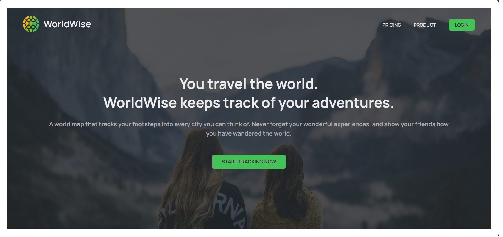
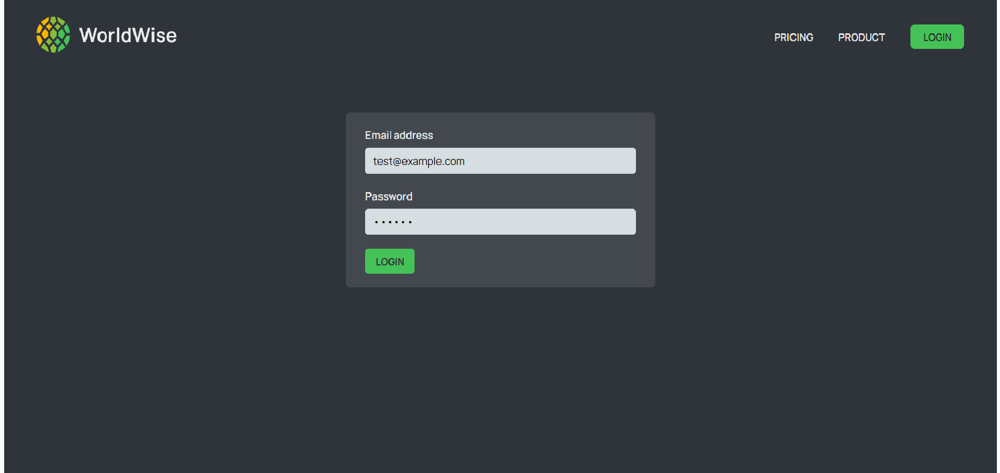
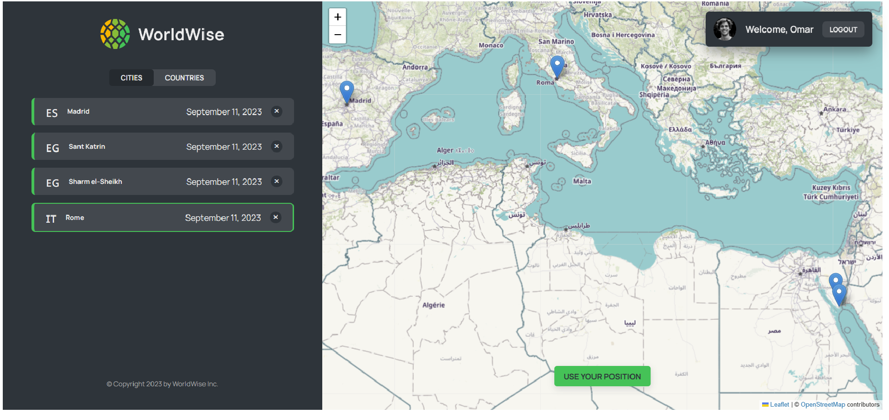
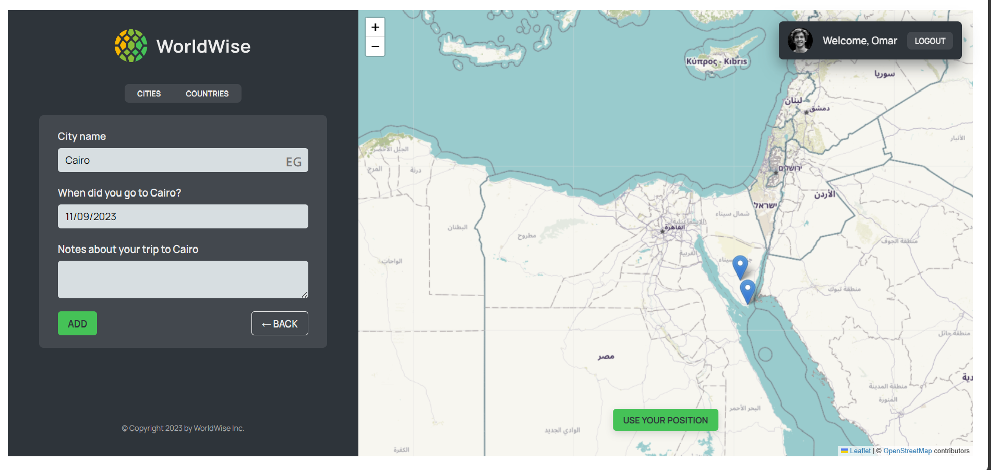
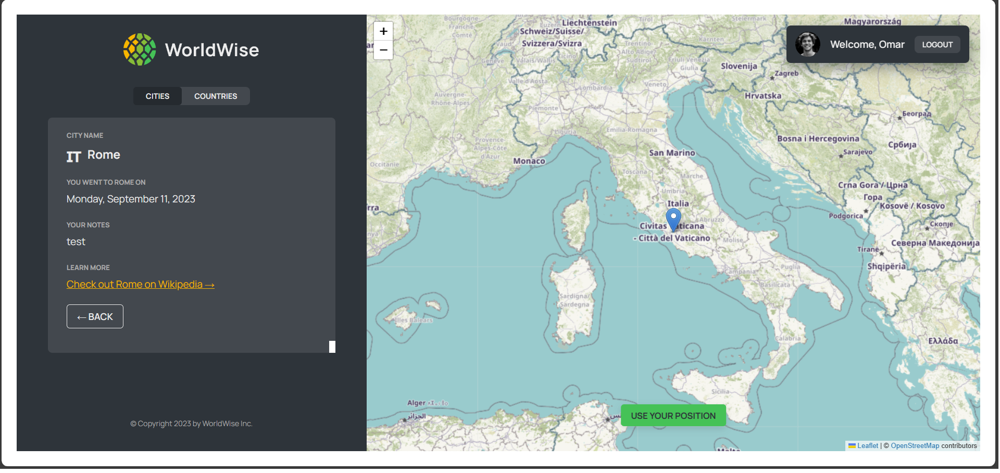

<div align="center">

<p align="center"></p>

</div>

## Description

- The worldwise application allows users to register for adventures and log their travels. Its main goal is to enable users to log in and keep track of the locations they've visited, giving them a map-based visual representation of their travels.
- Users can fill out a form to register the cities they have visited. The form likely includes fields such as city name, date of visit, and any additional details they wish to provide

## Technologies used

- Context Api : for state management
- React Router : for navigation
- Leaflet Library : for map visualization
- Geolocation : for getting user position

## Screenshots

<p align="center"></p>

<p align="center"></p>

<p align="center"></p>
<p align="center"></p>
<p align="center"></p>

<br/>

## 🛠️ Installation Steps:

<p>1. Clone the repository</p>

```
git clone https://github.com/OmarZahrah/worldwise-app.git
```

<p>2. Install the required dependencies </p>

```
npm install
```

<p>3. Start the development server</p>

```
npm run server
```

```
npm run dev
```

<br/>
